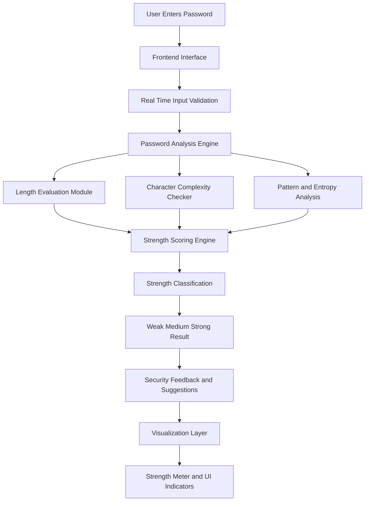

# 🔐 CipherGuard — AI-Powered Password Strength Analyzer

<p align="center">
  
  
  
  
  
</p>

<p align="center">
  <b>Real-time Advanced Password Security Intelligence with Futuristic Glassmorphism UI</b>
</p>

---

## 🌌 Overview

**CipherGuard** is a modern AI-powered Password Strength Analyzer that provides real-time password security intelligence using entropy calculation, character diversity analysis, and crack-time estimation — all processed securely on the client side.

It features a futuristic glassmorphism dashboard UI, animated strength meter, and AI secure password generation, making it ideal for cybersecurity portfolios, academic projects, and intelligent UI demonstrations.

---

## ✨ Key Features

- 🔐 Real-time Password Strength Analysis  
- 🧠 Entropy-Based Security Calculation  
- ⚡ AI Secure Password Generator  
- 📊 Crack Time Estimation (Brute-force simulation)  
- 🎨 Futuristic Glassmorphism UI Dashboard  
- 📱 Fully Responsive (Desktop + Mobile)  
- ✅ Requirements Validation Checklist  
- 🛡️ 100% Client-Side Privacy (No password storage)

---

## 🧠 System Working (Block Diagram)


------------------------------------------------------------------------

## ⚙️ System Architecture

### 🔄 Working Flow

1.  User enters or generates a password
2.  Input is securely masked and processed locally
3.  Analyzer evaluates:
    -   Length
    -   Uppercase & Lowercase
    -   Numbers & Symbols
    -   Entropy score
4.  Strength classification is computed
5.  Crack time is estimated using entropy model
6.  UI updates in real-time with:
    -   Strength meter
    -   Entropy score
    -   Requirements checklist
    -   Security intelligence feedback

------------------------------------------------------------------------

## 📁 Project File Architecture

    Password-Strength-Analyzer/
    │
    ├── public/
    │ └── favicon.ico
    │
    ├── src/
    │ ├── assets/
    │ │ └── icons, images, UI assets
    │ │
    │ ├── components/
    │ │ ├── PasswordInput.tsx
    │ │ ├── StrengthMeter.tsx
    │ │ ├── EntropyCard.tsx
    │ │ ├── CrackTimeCard.tsx
    │ │ ├── RequirementsList.tsx
    │ │ ├── GenerateButton.tsx
    │ │ └── DashboardCard.tsx
    │ │
    │ ├── utils/
    │ │ ├── passwordAnalyzer.ts
    │ │ ├── entropyCalculator.ts
    │ │ ├── crackTimeEstimator.ts
    │ │ └── passwordGenerator.ts
    │ │
    │ ├── hooks/
    │ │ └── usePasswordStrength.ts
    │ │
    │ ├── styles/
    │ │ └── index.css
    │ │
    │ ├── App.tsx
    │ ├── main.tsx
    │ └── vite-env.d.ts
    │
    ├── tailwind.config.js
    ├── postcss.config.js
    ├── tsconfig.json
    ├── package.json
    └── README.md

------------------------------------------------------------------------

## 🛠️ Tech Stack

-   React 18 + Vite\
-   TypeScript\
-   Tailwind CSS (Glassmorphism UI)\
-   Framer Motion (Animations)\
-   Lucide Icons\
-   Zxcvbn (Optional Strength Logic)

------------------------------------------------------------------------

## 🔐 Password Strength Evaluation Parameters

-   Length Analysis (8+ recommended)
-   Uppercase & Lowercase Detection
-   Numeric Complexity
-   Symbol Diversity
-   Entropy Score (Mathematical)
-   Pattern & Weak Password Detection
-   Brute Force Crack Time Estimation

------------------------------------------------------------------------

## 🚀 Installation & Setup

### 1️⃣ Clone the Repository

``` bash
git clone https://github.com/LoganthP/Password-Strength-Analyzer.git
cd Password-Strength-Analyzer
```

### 2️⃣ Install Dependencies

``` bash
npm install
```

### 3️⃣ Run the Development Server

``` bash
npm run dev
```

### 4️⃣ Open in Browser

http://localhost:5173/

------------------------------------------------------------------------

## 🛡️ Security & Privacy

-   No password storage
-   No backend logging
-   Fully client-side analysis
-   Secure input masking
-   Local entropy computation

------------------------------------------------------------------------

## 🎯 Use Cases

-   Cybersecurity Awareness Tools
-   Portfolio Projects (AI + Security)
-   Academic Mini/Major Projects
-   Password Policy Demonstrations
-   UI/UX Security Dashboards
